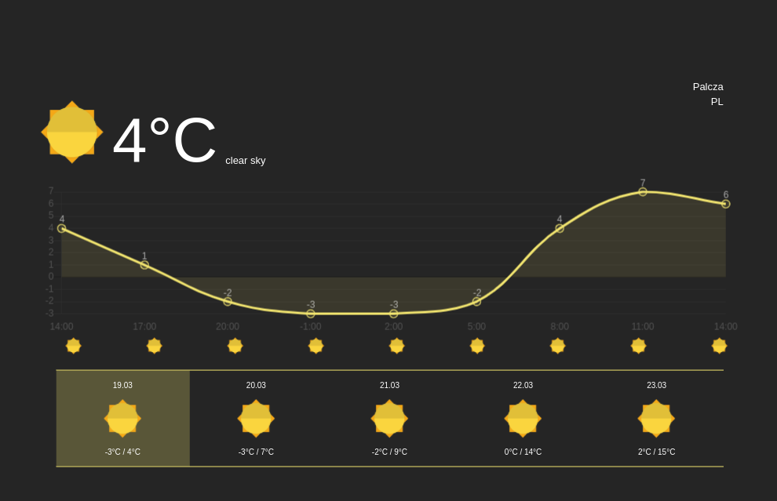

# Wojciechweather

### Description

This repository contains a simple weather website which was created in `HTML/CSS/JS` using `Openweather API` and `Chart.js`

### Try it yourself! 

**You can try it at:** https://behenate.github.io/weather-app/ 

*remember allow location, otherwise the app can't locate you*

**Or check out the screenshot below!**

